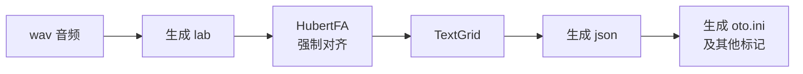

# **TextGrid2oto**

这是一个把 TextGrid / wav 转换为 **oto.ini** 等多种标记的程序，支持 CV、CVVC、VCV、ARPAsing 等录音方案。使用前您需要一定的 UTAU 等引擎的音源制作基础。

当前版本：**GUI v2.2**



## ⚠️ 重要：入口文件说明

| 文件 | 状态 | 说明 |
| --- | --- | --- |
| **`GUI.py`** | ✅ **最新版（推荐）** | wxPython 图形界面，功能最全，持续维护 |
| `main.py` | ❌ **已废弃** | 旧版命令行（手动输入）脚本，保留仅供参考 |
| `app.py` | ❌ **已废弃** | 旧版 Gradio WebUI，保留仅供参考 |

> 请始终使用 `GUI.py` 作为程序的入口。`main.py` 和 `app.py` 不再维护，可能缺少新功能甚至无法运行。
>
> `WEB-UI.py` 是基于 ONNX 模型的轻量 WebUI，属于另一套可选方案（见下文）。

## 功能特性

- 根据 wav 文件名（拼音 / 假名）自动生成 `.lab`
- 调用 SOFA / HubertFA ONNX 模型进行强制对齐，生成 TextGrid
- 将 TextGrid 转换为 json 并过滤、整理音素
- 生成多种格式的 `oto.ini`：**CV / CVVC / VCV / ARPAsing**
- oto 参数（左线、固定、右线、预发声、交叉等）可视化调节
- 支持批量处理、录音预设、oto 预设
- 多语言界面（中文 / English / 日本語）

## 目录结构（主要部分）

```
utau自动标注/
├── GUI.py                 # ✅ 最新入口（wxPython GUI）
├── main.py                # ❌ 已废弃（命令行）
├── app.py                 # ❌ 已废弃（Gradio WebUI）
├── WEB-UI.py              # 可选：ONNX 版 WebUI
├── onnx_infer.py          # ONNX 推理 / 强制对齐脚本
├── GUI.spec               # Windows 打包配置
├── GUI-macos.spec         # macOS 打包配置
├── build_GUI.bat          # Windows 一键打包脚本
├── config.txt             # 运行参数示例配置
├── i18n/                  # 多语言文本
├── img/                   # 图标等资源
├── lab_generate/          # 生成 lab
├── textgrid2json/         # TextGrid → json
├── json2oto/              # json → oto.ini
├── oto/                   # oto 读取/校验/参数面板
├── presamp/               # 各录音方案的 presamp.ini
├── tg2svdb/               # 转为 svdb 相关
├── HubertFA_model/        # ONNX 模型（需自行下载，见「环境配置」）
├── HubertFA/ SOFA/        # 模型训练与导出源码
└── requirements*.txt      # 依赖清单
```

## 环境配置

推荐使用 **conda** 创建独立环境（Python 建议 **3.12**，本项目在 **Python 3.12.13** 下测试通过）。

### 1. 创建并激活环境

```bash
conda create -n textgrid2oto python=3.12 -y
conda activate textgrid2oto
```

### 2. 安装依赖（GUI.py）

运行最新版 `GUI.py` 只需安装 `requirements-wxui.txt` 即可：

```bash
pip install -r requirements-wxui.txt
```

> 说明：`onnxruntime-webgpu` 为 ONNX Runtime 的 WebGPU 执行后端（需 **Python ≥ 3.11**，推荐 **3.12**，可在 Windows / macOS / Linux 上通过 GPU 加速）；如需改用 CPU 版，请将其替换为 `onnxruntime`。

<sub>旧的已废弃方案对应的依赖（**无需安装**，仅存档参考）：`requirements-webui-onnx.txt`（ONNX 版 WebUI）、`requirements.txt`（完整依赖，含 torch、训练、Gradio 等，体积较大）。</sub>

### 3. 下载并放置模型

ONNX 模型体积较大，未直接包含在仓库中，请从 Releases 页面下载：

- 📦 **[HubertFA_model 下载（Release v0.1.0）](https://github.com/xiaobaijunya/TextGrid2oto/releases/tag/v0.1.0)**
- 资源文件：`HubertFA_model.zip`（约 244 MB）
  - SHA256：`fde3cd59795754e7e1b2fa5495e40b43fe1efa28e3588765022542abe6ec8eb7`
- 模型源自 [wolfgitpr/HubertFA v0.0.7](https://github.com/wolfgitpr/HubertFA/releases/tag/v0.0.7)，为适配本项目架构做了部分修改。

**放置路径：** 将下载的 `HubertFA_model.zip` 解压，把解压出的 **`HubertFA_model` 整个文件夹放到项目根目录**（与 `GUI.py` 同级），最终结构如下：

```
TextGrid2oto/                    # 项目根目录
├── GUI.py
├── onnx_infer.py
└── HubertFA_model/              # ← 解压到这里
    ├── 1218_hfa_model/
        ├── model.onnx
        ├── vocab.json
        ├── config.json
        ├── zh.txt
        ├── en-arpasing.txt
        └── ja-*.txt
```

**注意事项：**

1. 目录层级必须为 `HubertFA_model/<模型名>/model.onnx`。**不要把 `HubertFA_model` 解压进另一层同名文件夹**（例如出现 `HubertFA_model/HubertFA_model/...` 就是错的）。
2. 每个模型文件夹内必须同时包含 `model.onnx`、`vocab.json` 以及对应语言的字典文件（如 `zh.txt`、`en-arpasing.txt`、`ja-hira-假名.txt` 等）。
3. 在 GUI 中选择模型时，请选择到 **具体的模型文件夹**（例如 `HubertFA_model/1218_hfa_model`），而不是 `HubertFA_model` 这一层。

### 4. 配置参数

运行参数可参考根目录的 `config.txt`（wav 路径、字典、presamp、忽略音素、录音方案、oto 参数等）。

## 如何运行

在已激活环境、且位于项目根目录下：

```bash
python GUI.py
```

程序会打开 wxPython 图形界面，按标签页依次操作即可：

1. **生成 lab**：选择 wav 所在文件夹与分隔符
2. **生成 TextGrid**：选择对应 ONNX 模型与字典进行强制对齐
3. **生成 json**：由 TextGrid 转换并过滤音素
4. **生成 oto**：选择录音方案（CV / CVVC / VCV / ARPAsing）生成 `oto.ini`

如需直接使用命令行对齐（调试用）：

```bash
python onnx_infer.py --onnx_path HubertFA_model/1218_hfa_model --wav_folder <wav目录> --language en --dictionary HubertFA_model/1218_hfa_model/en-arpasing.txt
```

## 如何编译（打包）

打包使用 **PyInstaller**，请先在目标环境安装：

```bash
pip install pyinstaller
```

### Windows

方式一：运行一键脚本

```bat
build_GUI.bat
```

方式二：手动执行

```bash
pyinstaller GUI.spec
```

产物输出在 `dist/TextGrid2oto/` 目录，可执行文件为 `dist/TextGrid2oto/TextGrid2oto.exe`。

> `build_GUI.bat` 中写死了 conda 路径与环境名（`F:\ProgramData\miniforge3`、`test`），请按自己的环境修改其中的激活命令。

### macOS

```bash
pyinstaller GUI-macos.spec
```

产物输出为 `dist/TextGrid2oto.app`。

> macOS 的 spec 已包含 `presamp`、`tg2svdb/字典`、图标等资源（`datas`）。如打包后运行时提示缺少资源文件，请对照 `GUI-macos.spec` 补全 `GUI.spec` 中的 `datas`。

## 注意事项

1. 生成 lab 的时候，请确保您的 wav 名称的 **拼音或假名** 和 **实际音频内容** 可以一一对应。
2. 若使用 scipy ≥ 1.14 并在 PyInstaller 打包后启动报错，请参考用户笔记处理 `scipy/stats/_distn_infrastructure.py` 中 `del obj` 的 `NameError` 问题。
3. 打包后的程序请连同 `dist/` 目录下的全部文件一起分发，不要只拷贝 exe。

## 联系我们

QQ 群聊：**1036935644**

## 相关链接

- [xiaobaijunya/TextGrid-AuditioMarkTools: TextGrid 的 Auditio 标记工具](https://github.com/xiaobaijunya/TextGrid-AuditioMarkTools)
- [wolfgitpr/HubertFA: Hubert-based Forced Aligner](https://github.com/wolfgitpr/HubertFA)
- [praat](https://github.com/praat/praat.github.io)
- [openvpi/DiffSinger](https://github.com/openvpi/DiffSinger)
- [stakira/OpenUtau: Open singing synthesis platform / Open source UTAU successor](https://github.com/stakira/OpenUtau)

## License

本项目采用 [GPL-3.0 license](https://github.com/xiaobaijunya/TextGrid2oto#GPL-3.0-1-ov-file) 开源协议。

> [!NOTE]
> 本 README 内容由 **DeepSeek V4.1 Flash** 生成，**xiaobaijun** 仅进行内容审查和修改，可能内容不完全正确，请以实际代码与程序行为为准。
